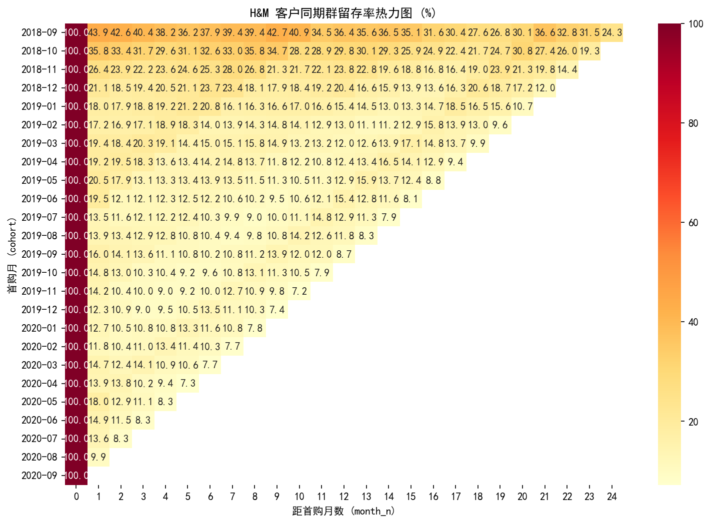
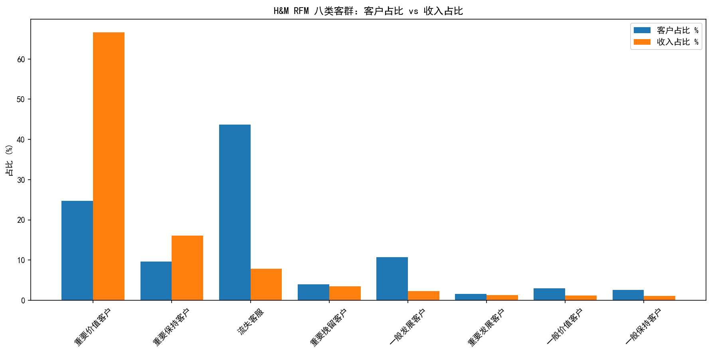
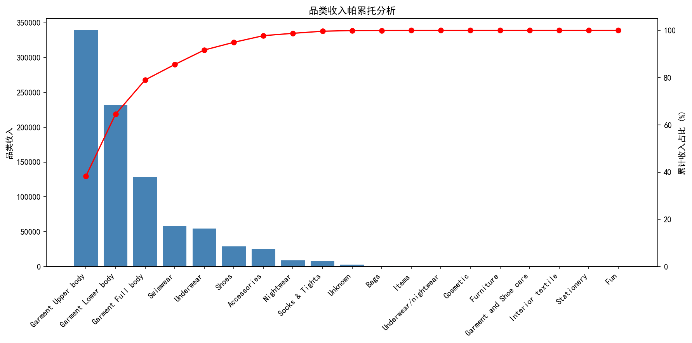

# H&M 客户复购结构分析：同期群留存 + RFM 分层

> ✅ 已完成 · 2026 年 8 月 · SQL + Python（不使用任何机器学习模型）

基于 H&M 真实交易数据（2018–2020，约 137 万客户、3179 万条交易），回答时尚电商最核心的问题：**这门生意到底是靠老客复购，还是靠不断拉新？**

---

## 一、业务问题

1. 客户的复购结构长什么样？一次性购买客群占比多少，贡献了多少收入？
2. 同期群（cohort）留存曲线如何衰减？第 N 月留存率是多少？
3. 哪些品类是「收入主力」，头部品类集中度有多高？
4. 沉睡 6 个月以上的客群规模多大，值不值得做召回？

对应真实岗位场景：跨境电商 / 用户增长分析师的存量经营分析（SHEIN、Shopee 类业务的复购与留存诊断）。

## 二、数据来源

- [Kaggle – H&M Personalized Fashion Recommendations](https://www.kaggle.com/competitions/h-and-m-personalized-fashion-recommendations/data)
- 三张表：交易（transactions）、商品（articles）、客户（customers）
- 数据窗口：2018-09 至 2020-09；交易表约 3.7GB（3179 万行），需分块读取
- 说明：该数据在全网几乎只被用于推荐系统竞赛，本项目**只做留存与分层分析，不涉及任何建模**——这正是本项目的差异化定位

## 三、分析框架

| 步骤 | 内容 | 状态 |
|---|---|---|
| 1. 明确分析目标 | 量化复购结构，定位复购驱动因素，评估沉睡客群召回价值 | ✅ |
| 2. 数据清洗与探索 | 大文件分块读取与列裁剪；客户年龄异常值处理 | ✅ |
| 3. 拆解问题维度 | 同期群 / 复购结构 / RFM 分层 / 品类 / 沉睡客群 | ✅ |
| 4. 归因与趋势 | 同期群留存矩阵、RFM 分层、复购结构、品类帕累托、沉睡客群测算 | ✅ |
| 5. 结论与建议 | 输出客群运营建议（复购钩子、换季召回、资源聚焦） | ✅ |

## 四、SQL 清单

| # | 查询 | 技术点 | 状态 |
|---|---|---|---|
| 1 | RFM 三维度指标 | 日期差 `julianday` + 分组聚合 | ✅ |
| 2 | RFM 五分位打分 + 八类分层 | `NTILE` + `CASE WHEN` | ✅ |
| 3 | 同期群月留存矩阵 | 子查询 + `JOIN` + 月份差计算 | ✅ |
| 4 | 复购结构（一次性 vs 复购） | `COUNT(DISTINCT)` + `CASE WHEN` + 窗口函数占比 | ✅ |
| 5 | 品类销售额帕累托分析 | 分块聚合 + `SUM() OVER (ORDER BY)` 累计占比 | ✅ |
| 6 | 沉睡客群（180 天未购）规模与历史价值 | `CASE WHEN` + 窗口函数占比 | ✅ |

## 五、Python 清单

- ✅ **3.7GB 交易表分块读取（`chunksize`）+ 只保留所需列**——真实的大数据处理工程场景
- ✅ 客户年龄缺失与异常值（<16 / >90）置空而非填充，`pd.cut` 分箱
- ✅ 分块聚合 → concat → 二次聚合，3179 万行压成 623 万行「客户×月」表
- ✅ 重新分块读交易表聚合到商品/品类粒度（`product_revenue` 10.5 万商品）
- ✅ Matplotlib / Seaborn 绘制留存热力图、RFM 分层图、帕累托曲线

## 六、目录结构

```
├── 01_clean_aggregate.ipynb   # 数据清洗与聚合（3.7GB 分块 → 客户×月表）
├── 02_sql_analysis.ipynb      # SQL 核心分析（RFM / 留存 / 复购 / 帕累托 / 沉睡）
├── 03_visualization.ipynb     # 3 张分析图
├── data/                      # 原始数据与 SQLite 数据库（不提交）
├── outputs/                   # 3 张分析图（PNG）
├── README.md                  # 本报告
└── 项目成果报告.md             # 详细成果报告
```

## 七、核心结论

> 数据口径：3179 万行交易 → 623 万行「客户×月」表；有交易客户 136.2 万；数据最后活跃日期约 2020-08-20。

### 1. 复购结构（SQL #4）——生意靠老客，不靠拉新

- 一次性购买客户 49.2 万（36.08%），仅贡献 **5.76%** 收入
- 复购客户 87.1 万（63.92%），贡献 **94.24%** 收入

**结论**：**64% 的复购客户贡献了 94% 的收入**，生意本质靠老客复购。运营重心放在首单后 30 天内促成第二次购买；拉新要精准，避免拉来只买一次的流量客。

### 2. 同期群留存（SQL #3）——首月断崖，但腰部客户有长期价值

- 2018-09 cohort：首月 100% → 第 1 月 43.86%（断崖式下跌）→ 第 24 月仍 24.30%
- 留存曲线在每年 3~6 月（换季）明显回升，峰值约 42.7%
- 越晚首购的 cohort 首月留存率越低（2018-09 为 43.86%，2020-02 降至 11.83%）——**后期拉新质量在下降**

**结论**：新客激活窗口是首月；两年后仍有 24% 客户留存，腰部客户值得长期经营；营销节点应踩换季；拉新渠道质量需监控。

### 3. RFM 分层（SQL #1/2）——客户两极分化

- 8 类客群：流失客户 59.5 万（44%）、重要价值客户 33.7 万（25%）、其余 43 万（31%）
- **重要价值客户（25% 的人）贡献 66% 收入**，流失客户（44% 的人）仅贡献 8%

**结论**：近一半客户处于流失状态，留存是生死线；重要价值客户是利润基本盘，资源应向「人少钱多」的客群倾斜。

### 4. 品类帕累托（SQL #5）——服装是绝对主业

- **前 3 类（上身 / 下身 / 全身服装）累计贡献 79% 收入**，前 4 类（+泳装）85.6%
- 头部品类 Garment Upper body（上身服装）单品占比 38.3%

**结论**：帕累托法则真实成立——19 个品类中 16% 贡献近 8 成收入。选品、备货、营销预算应聚焦服装三大类；尾部品类单独营销不划算。

### 5. 沉睡客群（SQL #6）——规模大但价值低，宜选择性召回

- 沉睡客户（>180 天未购）63.4 万（46.51%），仅贡献 **17.77%** 收入，人均历史价值为活跃客户的 1/4
- 活跃客户 72.9 万（53.49%），贡献 82.23% 收入

**结论**：沉睡客群规模大但历史价值低，**大规模召回不划算**。应选择性召回高价值沉睡客（RFM 分层中的「重要挽留客户」约 5.5 万人），将召回预算花在刀刃上。

## 八、可视化

### 图 1：同期群留存率热力图



对角线为 100%（首购当月），向右下衰减——首月断崖（43.86%）后缓慢下滑；可见每年 3~6 月出现浅色回升带（换季驱动）。

### 图 2：RFM 八类客群「客户占比 vs 收入占比」



橙色（收入）柱明显高于蓝色（人数）柱的，是「人少钱多」的价值客群；反之是「人多钱少」的低价值客群。

### 图 3：品类收入帕累托曲线



蓝柱为品类收入（降序），红线为累计收入占比——前 3 类即达 79%，帕累托法则直观呈现。

## 九、局限性与面试预案

- 数据截断于 2020 年 9 月，无法覆盖疫后消费行为变化——需在结论中说明
- 数据最晚活跃日期约 2020-08-20（非 9-30），RFM 的 Recency 参照日已在报告中注明
- 欧洲市场客单价结构 ≠ 东南亚跨境市场，但留存分析方法可平移
- 数据无退货字段，复购率为「口径内复购」，需主动交代口径
- `sales_channel_id`（线上/门店）字段未纳入本次分析，可作为后续扩展方向

## 十、参考

- 数据来源：Kaggle H&M 竞赛官方数据页
- 同类项目的数据清洗与 EDA 实现思路（均跳过其建模部分）
